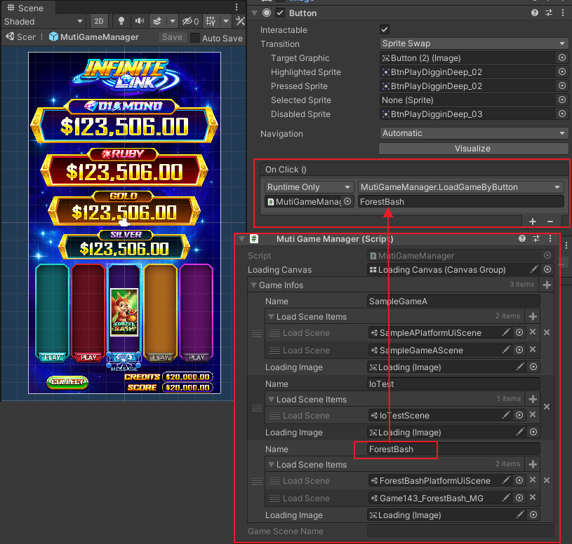

# AWP大廳開發手冊

大綱
* [物件結構](#物件結構)
* [載入說明](#載入說明)
* [進出流程](#進出流程)
* [切換遊戲](#切換遊戲)

## 物件結構
在 `Assets/ArkGame/ArkSlotGame/Platform/AwpPlatform/Common/Prefabs` 資料夾下可以找到 MutiGameManager.prefab，它就是 Awp 平台的大廳物件。
大廳物件身上掛有 `MutiGameManager` 腳本，用來設定遊戲場景的參考，後續章節會介紹如何用它來切換遊戲。
大廳物件底下包含平台攝影機、大廳 Canvas、以及代表各款遊戲的按鈕。


## 載入說明
在 App 的初始化階段，初始場景中的 `AwpPlatform_US` 會開始執行載入與初始化的流程，在這個過程中將會自動載入大廳物件，載入後的大廳物件會保留在初始場景中，初始場景不會被關閉，因此大廳物件會一直活著。


## 進出流程
* 進入大廳
MutiGameManager.cs 腳本內有 `EnterLobby` 方法，遊戲中可以透過呼叫這支方法來開啟大廳物件。
```
EnterLobby() {
	AwpPlatformBase.instance.SetPlatformState(PLATFORM_STATE.Lobby);
	gameObject.SetActive(true);
}
```
* 離開大廳
只有在大廳按下遊戲按鈕時會發生，MutiGameManager 會呼叫 `LoadGameByButton` 方法，執行釋放與載入遊戲的流程並關閉大廳物件。
```
ILoadGame(string p_name) {
	...
	gameObject.SetActive(false);
}
```

## 切換遊戲
大廳中會有各個遊戲的 ICON 按鈕，提供玩家點選想玩的遊戲。
遊戲 ICON 按鈕需要設定當玩家點選時呼叫 MutiGameManager 的 `LoadGameByButton` 方法，並且在參數欄位填入遊戲名稱(必須與 MutiGameManager 腳本身上的設定一致)。

`LoadGameByButton` 方法會執行釋放與載入遊戲的流程。
```
ILoadGame(string p_name) {
	//若有非玩家選擇的遊戲已被載入，則釋放它
	foreach (var _keyValuePair in gameInfoDict) {
		if (_keyValuePair.Key != p_name && _keyValuePair.Value.isLoaded) {
			yield return _keyValuePair.Value.UnLoadGame();
		}
	}
	//載入玩家選擇的遊戲
	if(gameInfoDict.TryGetValue(p_name, out var _gameInfo)) {
		yield return _gameInfo.LoadGame();
	}
}
```