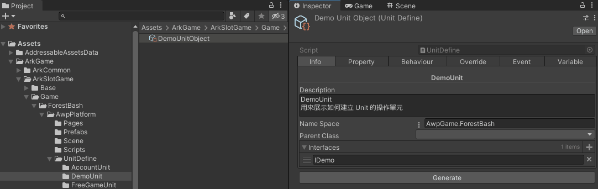
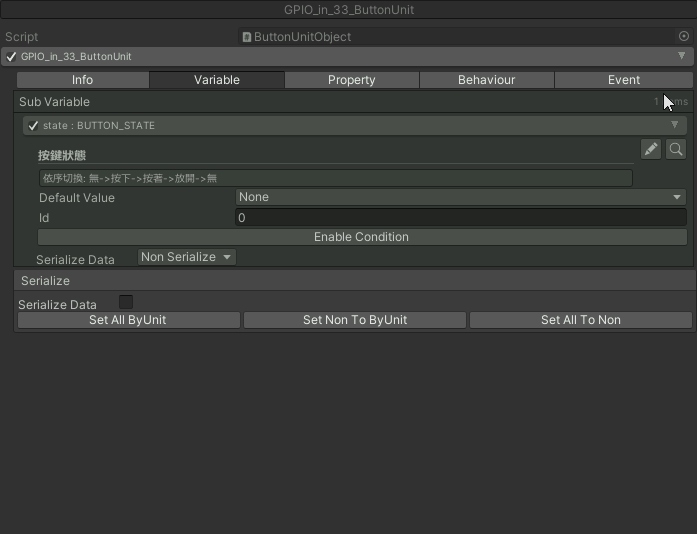

# FOCS 相關元件使用介紹

大綱
* [FOCS 簡介](#focs-簡介)
* [FOCS Unit](#focs-unit)
* [FOCS Value Type](#focs-value-type)
* [FOCS Object Editor](#focs-object-editor)
* [Unit Group Config](#unit-group-config)
* [Error Event Table](#error-event-table)
* [PageItem Permission Table](#pageitem-permission-table)

## FOCS 簡介
* 框架運行核心系統 (Framework Operation Core System)，寫作 FOCS 念作 Fox，又稱 狐心系統。
* 在 Unity 開發各種模組或框架的通用基礎架構，包含配置檔、操作單元、動態數值、行為、事件、錯誤處理...等。
* ASL2.0 是以 FOCS 架構進行開發，利用各種操作單元來管控遊戲、平台、與系統的各樣數值，並且透過行為與事件來控制整個系統的資料流與狀態。

## FOCS Unit
* 操作單元 (Unit)，為 FOCS 框架下的基礎元件，Unit 身上可以定義自己的基本信息 (Info)、變數 (Variable)、屬性 (Property)、行為 (Behaviour)、事件 (Event)。
* 在專案中需要先建立 Unit 的定義檔，在定義檔上設定 Variable、Property 等資料，接著透過生成按鈕自動生成 Unit 腳本，最後在專案中建立 Unit 元件並設定各項數值。
### 建立 Unit Define 定義檔
1. 在 Project view 中按下滑鼠右鍵，選擇 Create>FOCS>Unit Define，並將檔案名稱 "XxxUnitObject" 中的 "Xxx" 改成需要的名稱，例如用於控制主遊戲的操作單元取名叫 "MainGameUnitObject" (注意不得改掉 "UnitObject")。

2. 設定 Unit 定義檔上的資料：
* Info
	* Unit 基本信息。
	* Description: 針對此 Unit 的說明。
	* Name Space: Unit 所屬的 Namespace，例如森林狂歡的 Namespace 為 `AwpGame.ForestBash`。
	* Parent Class: 設定此 Unit 需要繼承自哪個 Unit，若不需要則不必設定。
	* Interfaces: 設定此 Unit 需要實作哪些介面，若不需要則不必設定。
	
* Variable
	* Unit 自帶的變數，通常透過 Unit 自身的 Behaviour 進行數值設定與調整，可供別人參考讀取。
	* 按下 "+" 按鈕增加 Variable 欄位，按下 "x" 按鈕可以刪除 Variable 欄位。
	* 每個 Variable 欄位的左半邊，可以使用下拉式選單設定 Variable 型別，以即輸入它的名稱；右半邊，可以輸入針對該 Variable 的說明。
	
* Property
	* Unit 自帶的屬性，通常在編輯期設定好數值來源後，運行期只能取得數值。
	* 按下 "+" 按鈕增加 Property 欄位，按下 "x" 按鈕可以刪除 Property 欄位。
	* 每個 Property 欄位的左半邊，可以使用下拉式選單設定 Property 型別，以即輸入它的名稱；右半邊，可以輸入針對該 Property 的說明。
	* 每個 Property 欄位，若勾選 ByScript 欄位，則該 Property 需要寫程式碼來取得數值；若沒勾選，則該 Property 可以在 Inspector 上設定數值。(參考 [使用 Value Type](#使用-value-type) 章節的 ByScript Property 補充說明)
	* 每個 Property 欄位，若勾選 canRef 欄位，則表示該 Property 可以被別人參考；若沒勾選，則該 Property 只能在 Unit 內部讀取。
	* 每個 Property 欄位，都有一顆 "Create Index" 按鈕，通常只有在 Property 型別為陣列時才有可能需要使用。按下按鈕會自動在 Variable 列表中增加一個對應該 Property 的 Index 數值。
	
* Behaviour
	* Unit 自身會執行的行為，通常透過監聽某個事件來處發行為的執行。
	* 按下 "+" 按鈕增加 Behaviour 欄位，按下 "x" 按鈕可以刪除 Behaviour 欄位。
	* 每個 Behaviour 欄位的 Info 頁面，需要先在 name 欄位輸入名稱，接著可以在 Description 欄位輸入針對該 Behaviour 的說明。
	* 每個 Behaviour 欄位的 Arg 頁面，可以設定執行該 Behaviour 時需要的參數。
		* 參數設定如同 Variable，"+" 和 "x" 按鈕可以添加或刪除參數欄位，每個參數可以設定型別、名稱、與說明，不需要參數則不必添加。
	
* Event
	* Unit 自身能發出的行為，通常會通過 Unit 自身的某個 Behaviour 來發出事件。
	* 按下 "+" 按鈕增加 Event 欄位，按下 "x" 按鈕可以刪除 Event 欄位。
	* 每個 Event 欄位的 Info 頁面，需要先在 name 欄位輸入名稱，接著可以在 Description 欄位輸入針對該 Event 的說明。
	* 每個 Event 欄位的 Arg 頁面，可以設定發出該 Event 時附帶的參數。
		* 參數設定如同 Variable，"+" 和 "x" 按鈕可以添加或刪除參數欄位，每個參數可以設定型別、名稱、與說明，不需要參數則不必添加。
	
* Override
	* 當 Unit 有繼承自其他 Unit，且繼承的對象有可以被覆寫的 Behaviour 時，Override 頁面才會有內容。
	* 若正在建立的 Unit 需要複寫某些繼承下來的 Behaviour，則勾選需要複寫的對象即可。
	
3. 按下 Generate 按鈕自動生成 Unit 與 Behaviour 腳本。
* Unit 腳本：包含 XxxUnitObject.cs 與 XxxUnit.cs，兩腳本內使用 `partial` 關鍵字來定義同一支 class，XxxUnit。
	* XxxUnitObject.cs 禁止直接編輯。
	* XxxUnit.cs 可由開發者自行添加成員。
* Behaviour 腳本：包含在 Unit 定義檔上設定的所有 Behaviour，每個 Behaviour 都會對應生成一份 OooBehaviourDefine.cs 與 OooBehaviour.cs。
	* OooBehaviourDefine.cs 為抽象的行為基類，禁止直接編輯。
	* OooBehaviour.cs 為行為實作，由開發者將行為實作添加於 `OnDoBehaviour` 中
 
### 建立 Unit 元件
1. 在專案資料夾 *Assets>Units* (ASL 專案專門存放 Unit 元件的資料夾) 內找到適當的位置，例如森林狂歡的 Unit 就放在 *ForestBash* 資料夾下，按下滑鼠右鍵，選擇 Create>FOCS Unit>{Unit 的 Namespace}>XxxUnit，即可建立一個 Unit 元件，檔案名稱基本不需要修改。

2. 設定 Unit 元件上的各項資料與數值：
* Info
	* Path: 供別人參考的路徑，不可編輯。
	* Group: 操作單元群組，需要設定此 Unit 元件屬於哪個群組，可參考下方 [Unit Group Config](#unit-group-config) 章節。
	* Enabe Condition 按鈕: 設定方式參考下方 Condition 段落。
	
* Variable
	* 設定各項 Variable 欄位的預設數值，例如將 bool 陣列的長度設為 10，且預設值設為 true。
	* 每個 Variable 欄位有 Enabe Condition 按鈕，設定方式參考下方 Condition 段落。
	
* Property
	* 設定各項 Property 欄位的數值，可以在 Inspector 上根據需求設定數值的來源。
	* 設定數值的方式可以有非常多種可能，初學者可針對這一方面多進行嘗試。
	* 舉例將 boolList 陣列設定成循環陣列，該陣列長度為5，且索引值為偶數時數值為 true，索引值則參考 Unit 自身的 boolListIndex 變數。
	
* Behaviour
	* 列出 Unit 帶有的各項 Behaviour。
	* 每個 Behaviour 的 Info 頁面會列出參數資料。
	* 每個 Behaviour 的 Condition 頁面有 Enabe Condition 按鈕，設定方式參考下方 Condition 段落。
	* 每個 Behaviour 的 Listen 頁面可以設定 Behaviour 監聽哪些 Event，聽到設定的 Event 觸發則會執行此行為。
		* 按下 "+" 按鈕增加監聽事件，按下 "x" 按鈕可以刪除監聽事件。
		* 監聽事件的 Event 頁面要設定需要監聽的事件。
		* 監聽事件的 Condition 頁面有 Enabe Condition 按鈕，設定方式參考下方 Condition 段落。
		* 監聽事件的 Arg 頁面要設定 Behaviour 的參數，可以依照需求設定成常數，或是參考某個數值，亦或是 Event 自帶的參數等等。
	
* Event
	* 列出 Unit 帶有的各項 Event 以及對應的參數。
	
* Condition
	* Info 頁面的 Condition
		* 是否啟用此 Unit 元件的條件按鈕。
		* 預設沒開啟條件，表示啟用 Unit 元件。
	* Variable 欄位的 Condition
		* 是否能夠 set Variable 數值的條件按鈕。
		* 預設沒開啟條件，表示能夠 set Variable 數值。
	* Behaviour 欄位的 Condition
		* 是否能夠執行 Behaviour 的條件按鈕。
		* 預設沒開啟條件，表示能夠執行 Behaviour 行為。
	* Behaviour 欄位中監聽事件的 Condition
		* 是否觸發監聽事件的條件按鈕。
		* 預設沒開啟條件，表示能夠觸發監聽事件。
	* 所有 Condition 的設定方式皆相同
		* 按下按鈕即可展開設定條件。
		* 根據需求將條件設置為常數，或是參考某個數值，亦或是經過某些運算後的結果。
		* 設定數值的方式如同 Property 有非常多種可能，初學者同樣可針對這一方面多進行嘗試。
	
3. 按下 Ctrl+S 存檔即完成 Unit 元件的設定。

## FOCS Value Type
* FOCS 數值型別，為 FOCS 框架下所使用的資料結構，當開發時需要某些複雜的資料結構，無論是要設定在 Unit 身上的 Variable，或是 Behaviour 和 Event 用來作為參數傳遞，皆可以透過 FOCS Value Type 來滿足。
* 在專案中需要先建立 Value Type 的定義檔，在定義檔上設定 Variable 和 Property，接著透過生成按鈕自動生成 Value Type 腳本，即可在 Unit 定義檔上設定此 Value Type。
### 建立 FOCS Value Type 定義檔
1. 在 Project view 中按下滑鼠右鍵，選擇 Create>FOCS>Value Type Define，並將檔案名稱 "XxxDefine" 中的 "Xxx" 改成需要的名稱，例如主遊戲所使用的資料結構取名叫 "MainGameDataDefine" (注意不得改掉 "Define")。

2. 設定 Value Type 定義檔上的資料：
* Info
	* Value Type 基本信息。
	* Description: 針對此 Value Type 的說明。
	* Name Space: Value Type 所屬的 Namespace，例如森林狂歡的 Namespace 為 `AwpGame.ForestBash`。
	* Use Custom Member: 是否有自定義成員方法的需求，例如需要自行實作資料結構內某個 Variable 的 Set 方法。
	
* Variable
	* Value Type 包含的變數，通常透過持有此 Value Type 的 Unit 之 Behaviour 進行數值設定與調整，可供別人參考讀取。
	* 設定方式如同 Unit 的 Variable。
	
* Property
	* Value Type 包含的屬性，通常在編輯期設定好數值來源後，運行期只能取得數值。
	* 設定方式如同 Unit 的 Property。
	
3. 按下 Generate 按鈕自動生成 Value Type 腳本。
* Value Type 腳本：包含 XxxDefine.cs 與 Xxx.cs，兩腳本內使用 `partial` 關鍵字來定義同一支 class，Xxx。
	* XxxDefine.cs 禁止直接編輯。
	* Xxx.cs 僅有在勾選 Use Custom Member 時會生成，可由開發者自行添加成員。
 
### 使用 Value Type
* Unit 使用 Value Type
	* Unit 定義檔上設定 Value Type
	Unit 身上的 Variable、Property、Behaviour 參數、Event 參數都能使用新建立好的 Value Type。
	
	* Unit 元件上設定 Value Type 資料
	定義檔重新按下 Generate 按鈕重生腳本後，即可來到 Unit 元件上設定新加入的 Value Type 資料。
		* 在 Variable 中的 Value Type，需要對它所包含的每個數值進行設定。
		
		* 在 Property 中的 Value Type，需要設定它的數值來源。
		
		* 在 Behaviour 與 Event 的參數中的 Value Type，可以拿來作為參數傳遞。
		
* Value Type 的 Set 方法
	* 根據開發需求的不同，Value Type 有可能會是一個複雜的資料結構，因此在透過程式碼為每個 Value Type 所包含的 Variable 賦值時，容易寫成一大坨不易閱讀的程式碼。
	* 因此我們通常會將 Value Type 的 Set 方法寫在 Value Type 生成時的 Xxx.cs 腳本中，方便程式碼的管理與閱讀。
	* 舉例如下：
	```
	// DemoData.cs
	public partial class DemoData : ClassValue<DemoData> {
		//傳遞 JSON 資料讓 Value Type 自行解析
		public void SetDemoData(JSON p_json) {
			demoID = p_json.ToInt("demo_id");
			demoMsg = p_json.ToString("demo_msg");
		}
	}
	```
* ByScript Property 補充說明
	* 若是 Property 中有勾選 ByScript 的欄位，在生成腳本後會出現編譯錯誤，點擊編譯錯誤的 log 可以看到類似於下方的程式碼裡面，最後面的 `GetXxx` 不存在於目前的內容中。
	```
	AddMemberAsProperty(p_variable, xxxProperty, "xxx", "...", false, GetXxx);
	```
	* 這是因為開發人員需要在可由開發者自行添加成員的腳本中自行實作 `GetXxx` 方法，。
	* 自行實作 ByScript Property 舉例如下：
	```
	// DemoDataDefine.cs 禁止直接編輯的腳本
	AddMemberAsProperty(p_variable, demoShaderColorProperty, "demoShaderColor", "來自範例Shader的顏色", false, GetDemoShaderColor); // => GetDemoShaderColor 不存在於目前的內容中
	
	// DemoData.cs 可由開發者自行添加成員的腳本
	Color GetDemoShaderColor() { return Color.white; } // => 自行添加此方法並實作內容
	```

## FOCS Object Editor
* 點擊工具列 Window>Focs>FocsObjectEditor 可以開啟 FOCS 編輯器。
* FOCS 相關物件包含 Config 設定檔、Error 錯誤定義表、Input 輸入配對表、Permission 權限列表、以及 Unit 操作單元，全部都能在 FOCS 編輯器上進行編輯。
### 編輯器基本操作
* 編輯器面板的左邊選單，能依照種類收起或展開。
* 左鍵點選開啟的元件都會記錄在右半邊上方的頁籤中，左鍵點選頁籤切換分頁、中鍵關閉分頁。
* 編輯器選單上方有搜尋欄位，且支援模糊搜尋。

* FOCS 編輯器與資源 Inspector 之間可以透過  和  按鈕來回跳轉。

### 操作單元間的參考查找
* 開發過程中，若想知道 Unit 身上的 Variable、Property 等數值有哪些地方參考，或者想知道 Unit 的 Event 有誰在監聽，可以透過  按鈕來進行查找。
* 搜尋功能會同時在資源與開啟的場景中進行尋找，並分別顯示於 InAsset 和 InScene 分頁中。

* 在搜尋結果中：
	* 若目標為一般資源或場景物件，顯示  按鈕，點擊按鈕跳轉到該物件進行編輯。
	* 若目標為操作單元，顯示  按鈕，點擊按鈕跳轉編輯器的對應頁面進行編輯。
	
	* 無論是哪一種，都能點擊  按鈕向下展開，直接在搜尋頁面檢視物件內容。
	
* 儘管是複雜屬性中的參考，也能正確被找到。


## Unit Group Config
* Mode 操作
* Group 設定

## Error Event Table
* 待補充

## PageItem Permission Table
* 待補充
