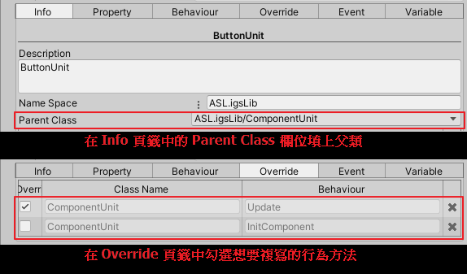

大綱
* [使用 FOCS 元件串接 IO 說明](#使用-focs-元件串接-io-說明)
    * [ComponentUnit](#componentunit)
    * [Button](#button)
    * [Acceptor](#acceptor)
    * [BillAcceptor](#billacceptor)
    * [Dispenser](#dispenser)
    * [ReceiptPrinter](#receiptprinter)
    * [IoTest 場景說明](#iotest-場景說明)

# 使用 FOCS 元件串接 IO 說明
* ASL 在 FOCS 的架構下，實作了各項實體裝置的 Unit 元件，使用者的操作與各種遊戲的事件會觸發裝置 Unit 的行為，以此來呼叫 igslib 的實作。
* 此章節將介紹所有裝置的 base 類，`ComponentUnit`，以及主要裝置如何使用 FOCS 進行串接，包含 `Button`、`Acceptor`、`BillAcceptor`、`Dispenser`、`ReceiptPrinter`，最後簡單說明 IOTest 場景可以做到哪些測試。

---
## ComponentUnit
* `ComponentUnit` 是所有裝置 component 的基類，可以在專案資料夾 *Packages/Arcade Spec Layer/Runtime/IO/IOComponent/ComponentUnit* 裡面找到它，所有的裝置元件也都存放在 *IOComponent* 資料夾下。
* 它身上定義了兩個行為，`Update` 與 `InitComponent`，分別負責裝置元件的更新與初始化，基本上 base 類的行為不做任何事，僅提供給需要的裝置各自複寫下去實作。
* Unit 的繼承與複寫

---
## Button
* 實體按鈕的 Unit 複寫了 `Update` 行為，行為內透過 `Button_NativeAPI.is_press_down` 與 `Button_NativeAPI.is_pressed` 來呼叫 igslib 的實作取得實體按鈕的狀態，並設定給 Unit 身上的 state。
* 當 Unit 身上的 state 設定為 `BUTTON_STATE.Down` 或 `BUTTON_STATE.Up` 時，會分別觸發 `OnDownEvent` 或 `OnUpEvent`。

---
## Acceptor
* 投幣機的 Unit 複寫了 `Update` 行為，行為內透過 `Acceptor_NativeAPI.get_value` 來呼叫 igslib 的實作取得投幣機投了多少錢。
* 當 Unit 取得投幣機的數值大於零時，則觸發 `OnMoneyInEvent`。
* Unit 身上還有定義其他行為：
    * ClearError: 呼叫 `Acceptor_NativeAPI.clear_error` 清除錯誤狀態。
    * SetInhibitiveState: 呼叫 `Acceptor_NativeAPI.set_inhibitive_state` 設定是否允許吃幣。
    * SetConfirmRange: 呼叫 `Acceptor_NativeAPI.set_confirm_range` 設定承認時間範圍。
    * SetJammedTime: 呼叫 `Acceptor_NativeAPI.set_jammed_time` 設定卡幣時間。
    * SetHighActive: 呼叫 `Acceptor_NativeAPI.set_high_active` 設定高/低位觸發。
* 在 `AcceptorUnit` 腳本裡面有實作 Unit 的 `Property` 數值取得：
    * errorState: 呼叫 `Acceptor_NativeAPI.get_error_state` 取得投幣機的錯誤狀態。

---
## BillAcceptor
* 讀鈔機的 Unit 繼承自 `AcceptorUnit`，因此它可以執行投幣機所定義好的行為。
* 讀鈔機的 Unit 複寫了 `Update` 行為，行為內和 `AcceptorUnit` 一樣透過 `Acceptor_NativeAPI.get_value` 來呼叫 igslib 的實作取得讀鈔機入鈔多少錢。
* 當 Unit 取得讀鈔機的數值大於零時，則觸發 `OnMoneyInEvent`。
* Unit 身上還有定義其他行為：
    * SetDenominationPermission: 呼叫 `BillAcceptor_NativeAPI.set_denomination_permission` 設定接收的面額類型，此函式設定函式庫內的暫存值。
    * FlushDenominationPermission: 呼叫 `BillAcceptor_NativeAPI.set_denomination_permission` 將接收面額的設定暫存值傳送給韌體，使正式生效。
    * ReScanDevice: 呼叫 `BillAcceptor_NativeAPI.re_scan_device` 重新掃描裝置。
    * RefreshDenominations: 呼叫 `BillAcceptor_NativeAPI.query_current_denomination` 與 `BillAcceptor_NativeAPI.get_denomination_permission` 更新 Unit 身上的 `Variable` `denominations`。
* 在 `BillAcceptorUnit` 腳本裡面有實作 Unit 的 `Property` 數值取得：
    * make: 呼叫 `BillAcceptor_NativeAPI.get_make` 取得讀鈔機品牌。
    * makeProtocol: 呼叫 `BillAcceptor_NativeAPI.get_make_protocol_string` 取得讀鈔機品牌對應的 protocol 字串。
    * currencyKind: 呼叫 `BillAcceptor_NativeAPI.get_current_currency_kind` 取得幣種字串。
    * reScanState: 呼叫 `BillAcceptor_NativeAPI.get_re_scan_state` 取得重新掃描裝置的狀態。

---
## Dispenser
* 出獎機的 Unit 複寫了 `Update` 行為，行為內透過 `Dispenser_NativeAPI.get_dispened_value` 來呼叫 igslib 的實作取得出獎機要出多少獎。
* 當 Unit 取得出獎機需要初獎的數量大於零時，則觸發 `OnTicketOutEvent`。
* Unit 身上還有定義其他行為：
    * TicketOut: 呼叫 `Dispenser_NativeAPI.add_value` 來讓出獎機出獎。
    * Reset: 呼叫 `Dispenser_NativeAPI.reset` 停止並重置整個出獎裝置。
    * SetConfirmRange: 呼叫 `Dispenser_NativeAPI.set_confirm_range` 設定多少時間內才會確認為正常出獎。
    * SetJammedTime: 呼叫 `Dispenser_NativeAPI.set_jammed_time` 設定超過多少時間會被認定是獎品卡住狀態。
    * SetEmptyTime: 呼叫 `Dispenser_NativeAPI.set_empty_time` 設定少時間沒有訊號會被認定是獎品用完狀態。
    * SetHighActive: 呼叫 `Dispenser_NativeAPI.set_high_active` 設定以高/低準位認定為出獎訊號。
* 在 `DispenserUnit` 腳本裡面有實作 Unit 的 `Property` 數值取得：
    * errorState: 呼叫 `Dispenser_NativeAPI.get_error_state` 取得出獎機錯誤狀態。
    * isIdle: 呼叫 `Dispenser_NativeAPI.is_idle` 取得出獎機是否閒置。

---
## ReceiptPrinter
* printer 的 Unit 複寫了 `InitComponent` 行為，行為內實作了初始化 printer 的內容：
    1. 執行 `Detect` 行為偵測裝置。
    2. 呼叫 `ReceiptPrinter_NativeAPI.set_serialNum` 設定列印票據時的驗證碼。
    3. 執行 `ApplyFields` 行為設定列印票據時的各欄位資料。
    4. 呼叫 `ReceiptPrinter_NativeAPI.set_cmd` 設定列印命令類型。
    5. 註冊列印命令改變的事件，當列印命令改變時，呼叫 `ReceiptPrinter_NativeAPI.set_cmd` 重新設定並執行 `Detect` 行為重新偵測裝置。
* Unit 身上還有定義了其他行為：
    * Detect: 呼叫 `ReceiptPrinter_NativeAPI.initialize` 偵測裝置(支援 N 牌)。
    * ApplyFields: 呼叫 `ReceiptPrinter_NativeAPI.set_field` 更新票據欄位資料。
    * PrintReceipt: 呼叫 `ReceiptPrinter_NativeAPI.print_receipt` 列印一張洗分票據。
    * PrintShortTerm: 呼叫 `ReceiptPrinter_NativeAPI.print_short_term` 列印一張前帳目資料。
    * PrintLongTerm: 呼叫 `ReceiptPrinter_NativeAPI.print_long_term` 列印一張長期帳目資料。
    * PrintSelectedCashin: 呼叫 `ReceiptPrinter_NativeAPI.print_selected_cashin` 列印選擇的 cashin 資料。
    * PrintAllCashin: 呼叫 `ReceiptPrinter_NativeAPI.print_all_cashin` 列印全部 cashin 資料(最多 10 筆)。
    * PrintSelectedCashout: 呼叫 `ReceiptPrinter_NativeAPI.print_selected_cashout` 列印選擇的 cashout 資料。
    * PrintAllCashout: 呼叫 `ReceiptPrinter_NativeAPI.print_all_cashout` 列印全部 cashout 資料(最多 10 筆)。
* 在 `ReceiptPrinterUnit` 腳本裡面有實作 Unit 的 `Property` 數值取得：
    * errorState: 呼叫 `ReceiptPrinter_NativeAPI.get_error_state` 取得 printer 錯誤狀態(支援 N 牌)。
    * printerState: 呼叫 `ReceiptPrinter_NativeAPI.get_printer_state` 取得 printer 列印狀態(支援 N 牌)。
    * powerState: 呼叫 `ReceiptPrinter_NativeAPI.get_power_up_state` 取得 printer 電源狀態(支援 N 牌)。

---
## IoTest 場景說明
* IoTest 場景主要是用來測試裝置 Unit 的事件串接是否正確，並且觀察裝置的錯誤狀態以及各項資訊。
* 場景檔案可以在專案資料夾 *Assets/ArkGame/ArkSlotGame/Game/IoTest/Res/Scenes* 裡面找到。
* 測試場景中包含以下裝置的測試項目：
    * Button: 測試實體按鈕按下與放開的事件、觀察實體按鈕狀態。
    * Acceptor: 測試開分不同金額的事件與分數是否正確、觀察裝置錯誤狀態。
    * BillAcceptor: 測試讀鈔機收到不同面額的鈔票事件與分數是否正確、觀察裝置錯誤狀態、觀察讀鈔機裝置各項資訊。
    * Dispenser: 測試出獎機收到出獎事件與出獎數量是否正確、觀察裝置錯誤狀態、觀察出獎機發生錯誤時的出獎狀況。
    * Meter: 測試 Meter 收到跳表事件的跳表狀況。
    * Lamp: 測試 Lamp 的開關事件。
    * Printer: 測試 Printer 的列印事件與列印資料是否正確、觀察裝置錯誤狀態、驗證列印出來的票據格式。
