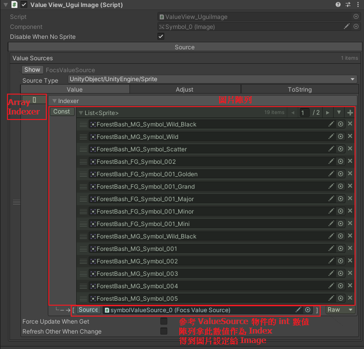

大綱
* [如何使用 ASL 客製化遊戲的帳目資料](#如何使用-asl-客製化遊戲的帳目資料)
    * [建立遊戲帳目資料](#建立遊戲帳目資料)
    * [調整 Lasthand 主頁](#調整-lasthand-主頁)
    * [建立遊戲 Lasthand 頁面](#建立遊戲-lasthand-頁面)

# 如何使用 ASL 客製化遊戲的帳目資料
* 為了能夠顯示遊戲客製的帳目資料，需要先建立以 FocsValue 形式存在的帳目資料結構，並且使用 Unit 建立起資料流並儲存資料。
* 在顯示面則會使用 ValueView 去參考儲存資料的 Unit，從 Unit 身上拿到資料並進行客製化的顯示。
* 此章節有大量的實作與設定內容，建議搭配範例專案一起閱讀。

---
## 建立遊戲帳目資料
### 建立 FocsValue
* 在 FOCS 的架構下，我們讓資料以 FocsValue 的形式存在，方便它在 Unit 之間傳遞。
* 以 ForestBash 為例，我們定義了一個 FocsValue 叫 `MainGameData`，可以在專案資料夾 *Assets/ArkGame/ArkSlotGame/Game/ForestBash/AwpPlatform/UnitDefine/MainGameUnit* 下找到它的定義檔。
* `MainGameData` 為紀錄一手盤面各項資訊的 FocsValue 資料結構，主要的用途在於儲存 lasthand，它的 `Variable` 裡面定義了幾個資料如下：
    * result_wheels: 牌面結果(型別為 int 陣列)
    * totalWin: 總贏分(型別為 long)
    * totalBet: 總押注(型別為 long)
	* winType: 贏分類型(型別為 int)
    * bingo: 中獎資訊(型別為 Bingo 陣列，*Bingo 為 FocsValue)
    * bingoCount: 中獎線數(型別為 int)
    * time: 遊玩時間(型別為 AslTime， *AslTime 為 FocsValue)
	* 其他...
* 專案需要為各個遊戲建立各自的 "MainGameData"，在它身上就根據各自遊戲在 lasthand 頁面需要顯示的內容來定義資料。

* *補充說明 FocsValue `Bingo`
    * 定義檔放在 *Packages/Awp Platform/Runtime/UnitDefine/GameUnit*
    * 主要用途為儲存線獎資訊，它的 `Variable` 裡面定義了：
        * symbol_id: 中獎的圖騰 ID(型別為 int)
        * win: 單線贏分(型別為 long)
        * pos: 中獎圖騰在轉輪上的位置(型別為 int 陣列)
* *補充說明 FocsValue `AslTime`
    * 定義檔放在 *Packages/Arcade Spec Layer/Runtime/Machine/AslTime*
    * 主要用途為紀錄當下時間，它的 `Variable` 裡面定義了：
        * unixTime: 以2050為基準的秒數(型別為 int)
    * 為了方便使用 `AslTime` 來取時間，它的 `Property` 裡面定義了 year、mon、day、hour、min、sec，內部會透過邏輯去把 unixTime 轉成對應的數值讓外部取用。

### lasthand 資料流串接
* 以 ForestBash 為例，lasthand 資料流如下

```
// 1. Server 將這一手封包資料丟給 MainGameUnit
AslServer.BeforeSpin(){
    //將封包資料作為參數呼叫 MainGameUnit 的 Play 行為
    MainGameUnit.PlayBehaviour(data);
}

// 2. MainGameUnit 將封包資料解析成各項數值儲存成 MainGameData 資料結構
SampleMainGame_PlayBehaviour.OnDoBehaviour(){
    //儲存成 MainGameData
    SetMainGameData(...);
}

// 3. GameUnit 觸發 EndGame 事件時(這一手結束)，AccountUnit 聽到事件會執行 AddLasthandData 行為，將 MainGameData 存起來
Account_AddLasthandDataBehaviour.OnDoBehaviour(){
    //Unit 身上的 spinResult 陣列新增這一手的資料
    spinResultsCycleArray.AddData(mainGameData)
}
```

* 專案需要依照上述的方式，為每個遊戲建立 lasthand 的資料流，步驟簡易說明如下：
    1. 建立遊戲的 `MainGameData`
    2. 建立遊戲的 `MainGameUnit`，在它的 `Variable` 加上 `MainGameData` 資料
    3. 建立遊戲的 `AccountUnit`，在它的 `Variable` 加上 `MainGameData` 的「陣列」(因為要存數筆資料)
    4. 在 ASLServer.BeforeSpin 方法內呼叫 `MainGameUnit` 的 Play 行為
    5. 在 `MainGameUnit` 的 Play 行為內，實作儲存 MainGameData
    6. 在 `AccountUnit` 的實體上找到 AddLasthandData 行為，並未它設定要聽取 `GameUnit` 的 EndGame 事件
    7. 在 `AccountUnit` 的 AddLasthandData 行為內實作將 MainGameData 存進資料陣列

---
## 調整 Lasthand 主頁
* 在 SystemPages 場景中，有一頁 Last Hand Home Page，它是 ASL 預設的 Lasthand 主頁。
    * SingleGame 的機種會透過邏輯直接跳過這一頁
    * MultiGame 的機種則需要專案自行擴充此頁面

### SingleGame 機種如何跳過主頁
* 在 Lasthand 主頁物件身上掛有 `LasthandPageAction` 腳本，此腳本屬於 AwpPlatform 的腳本，專案基本上不需要修改它。
* 在 SingleGame 機種的環境下，專案需要勾選 `LasthandPageAction` 腳本身上的 `IsSingleGame` 欄位，若是 MultiGame 則要取消勾選。
* `IsSingleGame` 勾選後，腳本會透過邏輯，直接跳過 Lasthand 主頁，直接顯示遊戲的 Lasthand頁面。
* 未來系統會有自行判斷是否為 SingleGame 機種的能力(透過遊戲列表)，因此未來專案不用擔心忘記勾選。

### MultiGame 機種如何擴充主頁
* 在 Last Hand Home Page 的子物件 Items 下預設有三個 Spin History 物件，他們都是身上掛著 `PageItem` 的按鈕，每個按鈕代表各款遊戲。
* 專案需要在此頁面增減 Spin History 物件，為物件換上遊戲 icon 或按鈕圖片，並自行排版。
* 在 Spin History 物件的 `PageItem` 腳本身上，需要設定按下按鈕時會切換到哪個遊戲的Lasthand頁面。


---
## 建立遊戲 Lasthand 頁面
* 在 SystemPages 場景中，有一頁 ForestBash Last Hand Page，它屬於 ForestBash 自己的頁面，因此它的 prefab 與身上的腳本 `LasthandPageAction` 都存放在專案資料夾 *Assets/ArkGame/ArkSlotGame/Game/ForestBash/AwpPlatform/Pages* 下。
* `LasthandPageAction` 腳本抓著 `AccoutUnit` 的參考，以此取得 Unit 身上儲存的資料。
* 為了能夠將資料做顯示，我們一樣需要使用 ValueView 系統，在 ForestBash 的 lasthand 中，我們要將 ForestBash 的資料填到頁面中的各種元件裡面，因此我們實作 ForestBash 的 `LasthandDataView` 腳本來達成客製的需求。

### LasthandPageAction 腳本
* 此腳本為操作 lasthand 頁面的腳本，主要透過 `SetResultIndex` 方法來決定要從 `AccoutUnit` 身上取得哪一份 MainGameData 資料丟給 `LasthandDataView` 去顯示。
    * OnOpen: 頁面開啟時，設定 index 為 0，從 Unit 身上取得最新的資料。
    * NextHand: 按下下一手時，設定 index++，從 Unit 身上取得舊一手的資料。
    * LastHand: 按下上一手時，設定 index--，從 Unit 身上取得新一手的資料。

### LasthandDataView 腳本
* 此腳本繼承自 `CycleArrayDataView`，`CycleArrayDataView` 主要是用於顯示固定筆數的循環資料的 ValueView 系統，資料會來自某個 FocsValue，並將資料設定給腳本內所宣告的 `FocsValueSourceGetSetter`。
* 此腳本掛在 ForestBash Last Hand Page>Items>Game View>SpinResult 物件身上。
* 頁面身上的 `LasthandPageAction` 腳本抓著此腳本的參考，Page 會將要顯示的資料傳給此腳本。
* 在此腳本裡面，除了父類已經宣告好的 number，此腳本還多宣告了 time、symbolSources、frameSources 等 ValueSource，在下面的章節會分別介紹如何操作他們將資料顯示出來。

### 手數與遊戲名
* lasthand 頁面的副標題需要顯示 [手數] OF [遊戲名]，例如 1 OF ForestBash，因此我們建立一個 Text 物件叫 Title，並為它建立一個空的子物件，叫 No。
* 先在 No 身上加入 `FocsValueSource` 腳本，把他設定為數值來源的物件。
    * No 設定 SourceType 為 Temp 形式的 int。
* 接著在 Title 物件身上加入 `ValueView_UguiText` 腳本，並為他添加到三個 ValueSource
    * 第一個 ValueSource 設定為 int 形式，選擇「Source Component Ref Value」，並拉上 No 物件做為參考。
    * 第二個 ValueSource 設定為 string 形式，選擇「Const」，並填入 " OF " 字串。
    * 第三個 ValueSource 設定為 string 形式，選擇「Const」，並填入遊戲名稱字串。
    * 設定好之後，遊戲運行時，Title 的 Text 文字就會自動顯示成三個 ValueSource 的結果組合起來的字串，像是 [No的int數值][ OF ][遊戲名稱字串]。
    
* 接下來我們要對 No 與 GameName 設定正確的數值，設定的方法會透過 `LasthandDataView` 腳本，以下稱它為 DataView。
    * DataView 抓有 No 的參考，它會將 `LastHandPageAction` 丟過來的 index 數值設定給 No 物件的 ValueSource。

### 遊戲時間、贏分與各項數值
* lasthand 頁面需要顯示每一手遊戲的遊玩時間與獲獎金額，因此我們建立兩個 Text 物件叫 GameTime 與 TotalWin，並且在他們身上都加入 `ValueView_UguiText` 腳本。
    * GameTime 設定 SourceType 為 Temp 形式的 AslTime。
    * TotalWin 設定 SourceType 為 Temp 形式的 long。
* 在頁面中，我們希望時間資訊顯示的格式為 TIME: MM/DD/YYYY HH:mm:ss，並且我們希望獲獎贏分顯示的格式為 TOTALWIN: XXX，因此我們需要在他們身上的 `ValueView_UguiText` 腳本中，切換到 `ToString` 頁籤去做設定。
    * GameTime 將 Base To String Adjust 欄位選擇為 `ValueAdjustAslTimeCustomFormat`，並且在下方欄位中填入 `TIME: {AutoDate} {3:D2}:{4:D2}:{5:D2}`。
    
    * TotalWin 則是點擊 Extend To String Adjusts 的「+」號按鈕，並且在下方欄位中填入 `TOTALWIN: {0}`。
    
* 接下來我們要對 GameTime 與 TotalWin 設定正確的數值，設定的方法一樣透過 `LasthandDataView` 腳本，以下稱它為 DataView。
    * DataView 抓有 GameTime 的參考，它會將 MainGameData 裡面儲存的 time 資料設定給 GameTime 物件的 ValueSource。
	* `LasthandPageAction` 抓有 TotalWin 的參考，它會將 AccountUnit 裡面儲存的最終贏分資料設定給 TotalWin 物件的 ValueSource。
* 其他還有各項遊玩數值需要顯示在 lasthand 頁面中，設置的方式皆與上述類似
	* Credits: DataView 拿 MainGameData 裡面儲存 credits 來設定
	* Score: DataView 拿 MainGameData 裡面儲存 score 來設定
	* Bet: DataView 拿 MainGameData 裡面儲存 totalBet 來設定
	* Handcount: DataView 拿 MainGameData 裡面儲存 handcount 來設定
	* 各種Win: `LasthandPageAction` 拿 AccountUnit 裡面儲存的 winDetails 資料來設定
	
### odds 表
* lasthand 頁面需要顯示 odds 表，並且依照每一手 bet 的不同，顯示出不同的數值，因此建立出 Image 和 Text 為一組的數個物件，並為 Text 掛上 `ValueView_UguiText` 腳本。
	* Text 設定 SourceType 為兩個數值相乘的 double 轉 long。
	* 其中一個數值需要參考 GameUnit 的 OddsTable
	* 另一個數值則參考頁面中的 Bet 物件
	

### 盤面結果、Nudge 結果與線獎框
* lasthand 頁面還會顯示每一手遊戲的盤面結果與 Nudge 結果，因此我們建立兩個轉輪的物件結構，包含兩組轉輪帶的 15 個圖騰 Image 物件以及 15 個線獎框的 Image 物件。
* 在所有圖騰身上都加入 `ValueView_UguiImage` 腳本，設定 SourceType 為 Array Indexer 形式的 Sprite，在陣列裡面設定為 Const 形式，並將遊戲中的圖騰圖片按照 ID 放到陣列中。
    * 我們需要為每個圖騰都建立一個對應的 ValueSource 物件，我們會把需要顯示的圖騰 ID 設定給 ValueSource，因此將每個 ValueSource 都設定為 Temp 形式的 int。
    * 回到圖騰身上，我們將剛剛建立好的陣列 index 選擇「Source Component Ref Value」並拉上對應的 ValueSource 物件做為參考。
    * 設定好之後，遊戲運行時，根據你設定好的圖片陣列以及 ValueSource 身上的 int 數值作為 index，圖騰 Image 就會顯示出對應 ID 的圖騰圖片。
    
* 在所有線獎框身上都加入 `ValueView_OnOff` 腳本，設定 SourceType 為 Temp 形式的 bool。
    * 線獎框物件的 Image 圖片設定為遊戲中使用的線獎框圖片，並將 Image 組件 unable 掉。
    * 在 `ValueView_OnOff` 腳本的 `OnOff` 頁籤中，在 `Switch(Boolean)` 欄位新增一個項目，將物件本身丟進參考欄位並設定方法為 `Image.enabled`。
    * 設定好之後，遊戲運行時，線獎框的 Image 組件會根據自身 ValueSource 的 bool 數值來觸發開關。
    
* 接下來要對所有圖騰和所有線獎框的 ValueSource 設定正確的數值，設定的方法一樣透過 `LasthandDataView` 腳本，以下稱它為 DataView。
    * DataView 抓有所有圖騰和所有線獎框的 ValueSource 的參考，它會將 MainGameData 裡面儲存的盤面結果 (result_wheels 陣列) 與線獎資料 (bingo.pos 陣列) 設定給圖騰與線獎框物件的 ValueSource。
	* Nudge 的盤面結果則透過另外一份 DataView: `NudgeResultDataView` 來進行設定，可以在相同的資料夾位置找到這個腳本，設定的方式也和 `LasthandDataView` 相同。

### 切換上一手或下一手
* Lasthand 資料最多會儲存 10 手，因此 lasthand 頁面要有切換上一手或下一手的功能，我們使用 `PageItem` 製作兩個按鈕，分別叫做 LastHandButton 與 NextHandButton。
    * LastHandButton 的 `PageItem` 腳本身上設定按下按鈕時執行 `LasthandPageAction.LastHand` 方法。
    * NextHandButton 的 `PageItem` 腳本身上設定按下按鈕時執行 `LasthandPageAction.NextHand` 方法。
    * LastHand 與 NextHand 方法如下，他們主要是調整頁面的 resultIndex，後續腳本會以調整後的 resultIndex 取得對應的 MainGameData，接著把它傳給 `LasthandDataView` 進行顯示。
    
    ```
    public void NextHand() {
	    SetResultIndex(resultIndex + 1);
    }
    public void LastHand() {
        SetResultIndex(resultIndex - 1);
    }
    ```

### MultiGame 頁面如何實現
* 參考 ForestBash Last Hand Page，為每款遊戲都製作自己的 Lasthand 頁面
* `LasthandPageAction` 與 `LasthandDataView` 腳本則需要仿照 ForestBash 的實作方式，去抓各自遊戲的參考，並實作遊戲資料的設定與顯示，如下所示。
```
Game1 Last Hand Page --> LasthandPageAction 腳本掛在這
└─ Items
　　└─ GameView
　　　　└─ SpinResult --> LasthandDataView 腳本掛在這
　　　　　　└─ Game1 顯示物件
      
Game2 Last Hand Page --> LasthandPageAction 腳本掛在這
└─ Items
　　└─ GameView
　　　　└─ SpinResult --> Game2LasthandDataView 腳本掛在這
　　　　　　└─ Game2 顯示物件
      
Game3 Last Hand Page --> LasthandPageAction 腳本掛在這
└─ Items
　　└─ GameView
　　　　└─ SpinResult --> Game3LasthandDataView 腳本掛在這
　　　　　　└─ Game3 顯示物件
```
