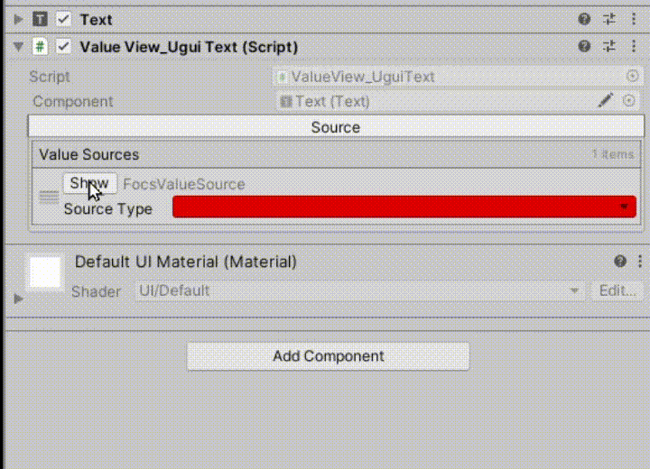
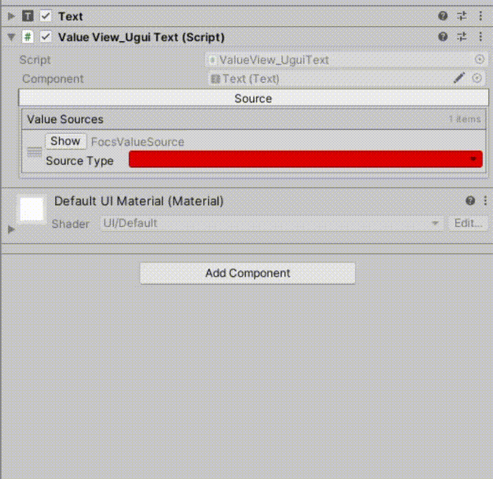
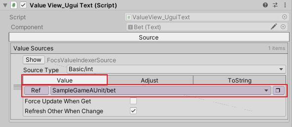
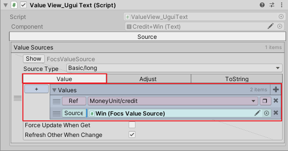
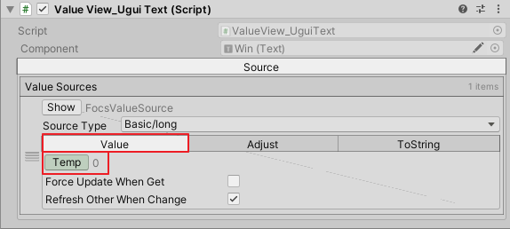
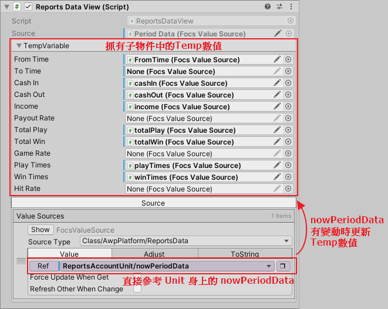
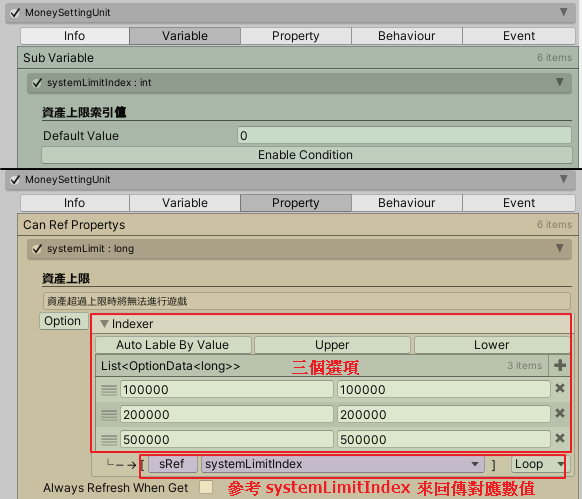
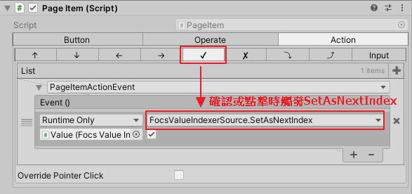

大綱
* [遊戲如何傳接 ASL 數值](#遊戲如何串接-asl-數值)
    * [遊戲底bar數值](#遊戲底bar數值)
    * [查帳頁數值](#查帳頁數值)

# 遊戲如何串接 ASL 數值
* ASL 數值屬於平台數值，粗略可以分為以下兩種：
    * 會顯示在底bar的數值，包含 credit、score、win、bet、line、hands
    * 查帳頁中的數值，包含 Reports、Settings 等頁面的帳目數值與設定值

---
## 遊戲底bar數值
### 數值顯示場景
* 在 SampleGame 中，我們將遊戲(轉輪)與平台數值頁面(底bar)，分為兩個場景：
    * SampleGameAScene: 遊戲轉輪場景
    * SampleAPlatformUIScene: 平台底bar場景

* 在 SampleGame 中，credit、score 這些底bar數值建立在平台底bar場景，可以在 *SampleAPlatformUIScene > GamePlatformPage > Bottom Bar Canvas > Bar Page > Bar* 物件下找到他們。

### 數值來自哪些 Unit
* bet、line、total bet
    * 在 *Packages/Awp Platform/Runtime/UnitDefine/GameUnit* 資料夾內有定義了一份 `GameUnitObject`，他身上的 `Property` 定義了 bet、line、totalBet 等數值。
    * 在 SampleGame 中，*Assets/ArkGame/ArkSlotGame/Game/SampleGame/UnitDefine/GameUnit* 資料夾下，我們定義了一份屬於 SampleGame 的 GameUnit，叫做 `SampleAGameUnitObject`，他繼承自 Packages 中的 `GameUnitObject`。
    * 在 *Assets/Units/SampleGameA* 資料夾下存放著 `SampleAGameUnitObject` 的實體 `SampleAGameUnit`，可以在實體上同時看到父類定義好的資料與自己本身的資料，在 SampleGame 裡面要顯示的 bet、line、total bet 數值就來自於 `SampleAGameUnit`。

* credit、score、hands
    * 在 *Packages/Awp Platform/Runtime/UnitDefine/MoneyUnit* 資料夾內有定義了一份 `MoneyUnitObjet`，他身上的 `Variable` 定義了 credit、score、handcount 等數值。
    * 在 *Assets/Units/AwpPlatform_US/System* 資料夾下可以找到 `MoneyUnitObjet` 的實體 `MoneyUnit`。
    * 資產屬於機台訊息，在任何遊戲中都使用同一份資料，因此在所有遊戲中顯示的 credit、score、hands數值都來自於 `MoneyUnit`。

### 數值在 Unit 中如何變動
* bet、line、total bet
    * 在 `SampleGameAUnit` 身上看到 `Property` 中，line 的定義為一個 int List，然後他會參考 Unit 身上的 lineIndex 數值，來回傳 List 中，該索引位置的數值。遊戲中切換線數的行為會去改變 lineIndex，因此 line 的數值就會跟著改變。
    * 一樣在 `SampleGameAUnit` 的 `Property` 裡面，bet 的定義會先去參考 line 的數值來取得不同的 int List，然後他會參考 Unit 身上的 betIndex 數值，來回傳 List 中，該索引位置的數值。遊戲中切換線數或切換押注的行為，會去改變押注段的 List 或 betIndex，因此 bet 的數值就會跟著改變。
    * `SampleGameAUnit` 的 `Property` 裡面還可以看到 total bet，他的定義為 bet 乘上 line，因此遊戲中切換線數或切換押注的行為，都會改變 total bet 的數值。

* credit、score、hands
    * 在 `MoneyUnit` 身上看到 `Variable` 中，有 credit、score、handcount 的數值，這些數值會在 Unit 的 `Behaviour` 行為中去更新。
        * AddMoneyBehaviour: 開分或贏分時，增加 credit 或 score
        * SubtractMoneyBehaviour: 洗分或玩一手時，減少 credit 或 score
        * SubtractMoneyBehaviour: 玩一手時增加 handcount
        * DoMoneyOutBehaviour: 洗分時減少handcount

### 數值如何串接 Ugui 進行顯示
* 使用 ValueView_UguiText 腳本
    * 在 Text 遊戲物件身上添加腳本 `ValueView_UguiText`，添加此腳本時會同時在物件身上自動添加 `FocsValueSource` 腳本。view 腳本會參考 source 腳本設定的數值來進行顯示，source 腳本的內容直接同步在 view 腳本身上的 Source 欄位，這個被自動添加的腳本一般情況下會被影藏，可以透過下圖演示的按鈕開關顯示。
    
    
    * 設定 source 的數值時先設定要顯示的 ASL 數值型別，接著在選擇你要顯示的數值參考。
    

    * 在 SampleAPlatformUIScene 場景中，底bar數值的身上都掛有 `ValueView_UguiText` 腳本，以此來設定該數值需要參考的 ASL 數值來源。

* 以 SampleGame 的 bet 為例，先在 Component 的 `Source Type` 欄位選擇數值型別為 int 後，在 Value 頁籤下，設定此數值要參考 SampleGameAUnit 的 bet 數值。
    

* 以 SampleGame 的 credit 為例，先在 Component 的 `Source Type` 欄位選擇數值型別為 long 後(credit數值可能會大於int)，在 Value 頁籤下，設定此數值會來自兩個數值相加，第一個數值要參考 MoneyUnit 的 credit 數值，第二個數值則參考自底bar中的 Win 分。

    
    
* 以 SampleGame 的 win 為例，先在 Component 的 `Source Type` 欄位選擇數值型別為 long 後(win數值可能會大於int)，在 `Value` 頁籤下，設定此數值為 `Temp`，表示該數值並不參考任何 ASL Value，任何腳本都可以抓取他的實體直接對他設定數值。

    

---
## 查帳頁數值
### 查帳頁顯示場景
* ASL 裡面，我們將所有系統頁面統一建立在 SystemPages 場景中，可以在 *SystemPages > System Page Canvas > Pages* 物件下看到所有頁面。

### Reports 頁的帳目數值
#### 數值來自哪些Unit
* 在 Reports 頁面中顯示了 cashIn、cashOut、totalPlay、totalWin、playTimes、winTimes 等一系列的數值，這些數值我們定義在 FocsValue `ReportsData` 裡面，可以在專案資料夾 *Packages/Awp Platform/Runtime/UnitDefine/Account/ReportsAcountUnit* 資料夾下可以找到 `ReportsDataDefine` 定義檔。

* Reports 頁面身上掛有 `ReportsPageAction` 腳本，此腳本參考了 `ReportsAccountUnit`，這個 Unit 的實體放在 *Assets/Units/AwpPlatform_US/Account* 資料夾內，它使用 `ReportsData` 定義了三種資料，包含 `nowPeriodData` (短期帳目資料)、`liftTimeData` (長期帳目資料)、`periodDataRaw` (短期帳目歷史資料)。
    * Reports 頁面 PERIOD 欄位所使用的資料來自 `ReportsAccountUnit` 的 `nowPeriodData`。
    * Reports 頁面 LIFETIME 欄位所使用的資料來自 `ReportsAccountUnit` 的 `liftTimeData`。
    * Reports 頁面 PAST PERIOD 按鈕叫出來的資料來自 `ReportsAccountUnit` 的 `periodDataRaw`。

#### 數值在Unit中如何進行變動
* 在 `ReportsAccountUnit` 的 `Behaviour` 裡面，可以看到許多行為的定義，包含 AddCashIn、AddTotalPlay...等等，這些行為會去改變 cashIn、playTotal...這些數值，觸發這些行為的方式為它們各自監聽的事件。
    * AddCashIn: 監聽 MachineUnit.OnMoneyInEvent，聽到事件更新 cashIn 數值。
    * AddCashOut: 監聽 MachineUnit.OnMoneyOutEvent，聽到事件更新 cashOut 數值。
    * AddTotalPlay: 監聽 SampleGameAUnit.OnPlayGameEvent，聽到事件更新 totalPlay 數值(此行為需要監聽所有遊戲的 OnPlayGameEvent)。
    * AddTotalWin: 監聽 SampleGameAUnit.OnEndGameEvent，聽到事件更新 totalWin 數值(此行為需要監聽所有遊戲的 OnEndGameEvent)。
    * AddPlayTimes: 監聽 SampleGameAUnit.OnPlayGameEvent，聽到事件更新 playTimes 數值(此行為需要監聽所有遊戲的 OnPlayGameEvent)。
    * AddWinTimes: 監聽 SampleGameAUnit.OnEndGameEvent，聽到事件更新 winTimes 數值(此行為需要監聽所有遊戲的 OnEndGameEvent)。

#### 數值如何串接Ugui進行顯示
* 使用 ValueView_UguiText 腳本
    * Reports 頁面上的數值皆使用 `ValueView_UguiText` 腳本，他們的數值參考來源設定為 `Temp`(設定方式可參考底bar的win分)，更新這些顯示數值的人為它們的父物件 Period Data 或 Lifetime Data。

* ReportsDataView 腳本
    * 在 Period Data 與 Lifetime Data 身上掛有 `ReportsDataView` 腳本，這個腳本直接參考了 `ReportsAccountUnit` 身上的 `nowPeriodData` 與 `liftTimeData`，他會在 `nowPeriodData` 與 `liftTimeData` 有更新的時候，去更新子物件中的各個 `Temp` 數值。

### Settings 頁的設定值
#### 設定值來自哪些Unit
* 在資料夾 *Assets/Units/AwpPlatform_US/Setting* 裡面，可以看到 `MoneySettingUnit`、`MoneyOutSettingUnit` 等各種和設定相關的 Unit 實體，設定頁面中的 setting 數值基本上就來自這些 Unit。
* 舉例像是設定值 SCORE BOX、PLAY SCORE，可以在 `MoneySettingUnit` 的 `Property` 選單中找到它們。

#### 設定值在Unit中如何進行變動
* 一組設定值是由兩個以上的數值選項組成，因此在 Unit 定義上，`Variable` 選單會有一個該設定值的 index，然後在 `Property` 選單就會有設定值的定義，這個設定值身上會定好所有選項的清單，它會參考 index 來決定回傳的數值。

* 以 SYSTEM LIMIT 來說，它的選項包含 100000、200000、500000 三個數值。
    * 在 `MoneySettingUnit` 的 `Variable` 選單中有 systemLimitIndex 數值。
    * 在 `MoneySettingUnit` 的 `Property` 選單中有 systemLimit 的定義，它包含三個選項，並且會參考 systemLimitIndex 來回傳對應的數值。
    

* 設定頁在調整設定值時，實際上會去修改 Unit 身上的各種 index，如此遊戲在取得設定值時，就會根據各自不同的 index 來得到對應的數值。

#### 設定值如何串接Ugui進行顯示
* 使用 ValueView_UguiText 腳本
    * Setting 頁面上的設定值一樣使用 `ValueView_UguiText` 腳本，他們的數值參考設定為各自的數值來源，例如 SCORE BOX 參考 `MoneySettingUnit/useScoreBox`，SYSTEM LIMIT 參考 `MoneySettingUnit/useSeystemLimit` 等等。
    * 設定值使用的 `ValueView_UguiText` 腳本所參考的來源腳本為 `FocsValueIndexerSource`，它繼承自 `FocsValueSource`，由於內部多實作了設定 index 的相關方法，因此它是專門用來給設定值這種透過調整 index 來切換數值的 FocsValue 作為數值來源的腳本。

* PageItem 腳本
    * `PageItem` 腳本是用於系統頁面中的各項元件操作，我們在按鈕或設定值等元件上掛了這個腳本，它可以控制游標系統以及觸控系統對該元件的各項操作。
    * 在設定值元件上，我們設定當玩家使用游標系統按下確認，或觸控系統點擊設定值時，會觸發 `FocsValueIndexerSource.SetAsNextIndex`，它會將參考的設定值 index 設成下一個，達成切換設定值的操作。
    
    
    * 各個按鈕頁籤說明
        * `↑`/`↓`/`←`/`→` : 游標系統停留在此元件時，按下`上`/`下`/`左`/`右`按鈕會觸發的功能。
        * `√` : 游標系統在此元件按下`確認`，或是觸碰系統`點選`時，會觸發的功能。
        * `x` : 游標系統在此元件按下取消會觸發的功能。
        * `⤵`/`⤴` : 游標系統在此元件按下`選擇`/`取消`選擇時會觸發的功能。
        * `Input` : 設定 `FOCS.Event` 會觸發此元件的功能。
