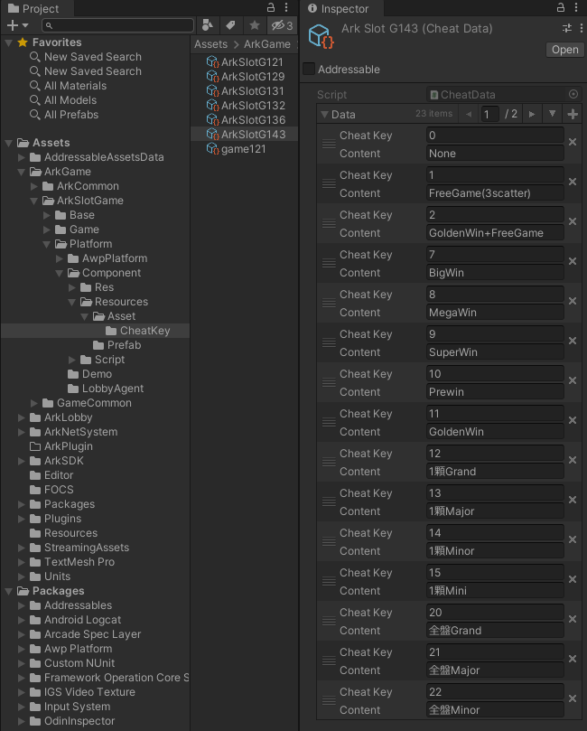

# CheatKey 使用說明

讓開發者能夠快速遊玩遊戲規格，讓流程開發更順暢。

大綱
* [新增 CheatKey](#新增-cheatkey)
* [CheatKey 介面介紹](#cheatKey-介面介紹)
* [CheatKey 串接](#cheatKey-串接)

## 新增 CheatKey
在專案資料夾 Assets>ArkGame>ArkSlotGame>Platform>Component>Resources>Assets>CheatKey 下，可以發現各款遊戲的 cheatKey 列表，以森林狂歡(ArkSlot143)為例，表格中定義了 23 組 cheatKey 資料。
每一組 cheatKey 資料由一個id(Cheat Key)與一個名稱(Content)組成。



## CheatKey 介面介紹
在遊戲畫面右下角有一顆 `CheatTool` 按鈕，按下該按鈕可以開啟 cheatKey 介面，該介面會依照 cheatKey 列表中定義的資料生出對應的按鈕。


## CheatKey 串接
在平台的 `AwpLobbyAgent_US` 腳本中，初始化UI介面的方法裡會將 cheatTool 創建出來，並將 cheatKey 列表的檔案名稱作為參數呼叫 `Init` 方法。
```
string cheatKeyGameId => "ArkSlotG143"
void OnInitUIAndAward() {
    cheatTool = CheatTool.Create(slotGameBarCtrl.transform);
    cheatTool.Init(cheatKeyGameId);
}
```

當遊戲內有按下任意一個 cheatKey 後，遊戲按下 Spin 時送給 server 的 command 封包會帶有額外資訊 `"custom"`，其中的 `"dev_mode"` 欄位就是 cheatKey 作弊碼，server 即可根據收到的作弊碼，來決定要送給 client 哪種轉輪盤面。
```
{ //spin command 封包
    ...
    "custom":{ "devmode":1 }
}
```