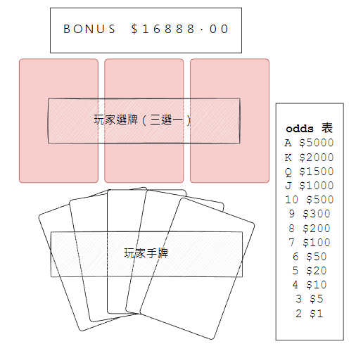
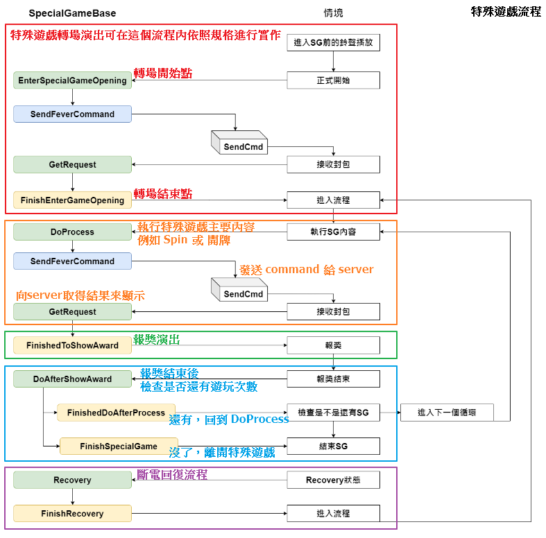

# 特殊遊戲開發手冊

大綱
* [特殊遊戲類型](#特殊遊戲類型)
* [特殊遊戲流程](#特殊遊戲流程)
* [特殊遊戲斷電回復](#特殊遊戲斷電回復)
* [特殊遊戲假資料/真機率資料](#特殊遊戲假資料真機率資料)
* [範例遊戲](#範例遊戲)

## 特殊遊戲類型
特殊遊戲是指，有別於主遊戲玩法，特殊的遊玩方式的遊戲，通常能獲得高額獎金，有自己的流程，並且也需要斷電回復。

* Bonus Game
通常在特殊遊戲過程中可以獲得各種獎金，甚至在達到某個條件時可以獲得 Bonus 大獎。
舉個簡單例子：
特殊遊戲的過程中，畫面會有三張蓋著的撲克牌供玩家選擇。
玩家每選一次牌，就把選到的牌加到玩家手牌，並重製三張牌，玩家總共需選五次。
玩家的每一次選牌都會獲得該張撲克牌所對應的獎勵金額。
選完五張牌後，若手牌達成黑桃同花順 10, J, Q, K, A 牌型，則獲得 Bonus 大獎。


* Free Game
最經典的特殊遊戲，給玩家數個免費的遊玩次數，遊戲會自動進行每次的 spin 並對獎，最後統一做一次大報獎。
接下來的特殊遊戲開發章節，將會以 Free Game 來做介紹。

## 特殊遊戲流程
特殊遊戲會有自己的流程，通常會在主遊戲的報獎後進入特殊遊戲的流程，在離開特殊遊戲時，會接回去到主遊戲的 `ProcessFinish` 流程。
特殊遊戲的流程大致如下：


* EnterSpecialGameOpening 特殊遊戲轉場演出
參考文件「[轉場開發手冊](../轉場開發手冊/readme.md#轉場開發手冊)」。
結束後進入特殊遊戲主要階段。

* DoProcess 執行特殊遊戲主要內容
特殊遊戲主要遊玩階段，在 Free Game 中，會呼叫轉輪開始 spin，並發送 command 給 server。
server 會拿機率給的盤面結果組成封包發送回來給遊戲。
遊戲收到封包執行 `GetRequest` 方法，將來自 server 的資料塞給轉輪，讓轉輪停下時結果為 server 給的結果。
結束後進入報獎階段。

* FinishedToShowAward 進行報獎演出
特殊遊戲主要內容最後呼叫 `FinishedToShowAward` 之後，程式會自動透過老虎機模組的 AwardController 進行報獎。
結束後進入檢查剩餘次數階段。

* DoAfterShowAward 檢查剩餘次數
若 server 封包說明這手完成後還有剩餘次數，則呼叫 `FinishedDoAfterProcess`，回到下一輪的特殊遊戲主要階段。
若 server 封包說明這手結束後沒有剩餘次數，則呼叫 `FinishSpecialGame`，離開特殊遊戲。

## 特殊遊戲斷電回復
在特殊遊戲的過程中，若遇到斷電，那麼開機回來之後需要回到特殊遊戲斷電時的狀態。
我們需要回復當前遊戲的各項數值，例如 Free Game 中，斷電時玩家玩到第幾手免費遊戲，斷電時玩家的特殊遊戲總贏分等等。
另一方面，在 Bonus Game 中，常常會有玩家行為(點選某個目標)發生，這種玩家行為也是斷電回復需要注意的。
拿前面提到的鋪克牌例子，我們需要紀錄每次玩家的點選結果，假設玩家選到第三張後斷電，那麼開機回來就要讓玩家看到手牌區有三張已經選到的牌。

## 特殊遊戲假資料/真機率資料
Free Game 接收機率資料的方式一律透過 server 發送回來的封包進行解析，無論是假資料還是真機率，都是走同一條路，差別在於 server 組封包之前是項機率取得結果或是直接拿假資料來組成封包。
特殊遊戲收到封包會去執行 `ReceiveRecoveryData` 方法，在此方法裡面會將資料塞給轉輪帶，最後呼叫轉輪停輪。
```
//收到 server 送來的封包
GetRequest(JSON jsonData)
{
    case SpecialGameState.PROCESS:
        ReceiveProcessData(jsonData);
}
ReceiveProcessData(JSON jsonData)
{
    //解析封包資料
    //塞結果給轉輪帶
    wheelBlockAry[currentBlockIndex].SpinRequest(args);
    ...
    //呼叫轉輪停輪
    wheelBlockAry[currentBlockIndex].StopAll();
}
```

## 範例遊戲
此章節會列出森林狂歡中，Free Game 的流程走法並簡述主要在做的事情。

	1. EnterSpecialGameOpening
		1.1 Initialized 重置特殊遊戲資料
		1.2 SendFerverCommand 發送初始化特殊遊戲的 command 給server

	2. GetRequest
		2.1 ReceiveInitData 設定特殊遊戲初始化資料
		2.2 ShowOpening 特殊遊戲轉場演出
		2.3 FinishEnterGameOpening 完成特殊遊戲轉場

	3. DoProcess
		3.1 WheelSpin 轉動轉輪
		3.2 SendFerverCommand 發送遊玩特殊遊戲的 command 給server

	4. GetRequest
		4.1 ReceiveProcessData 解析封包資料並塞結果給轉輪帶
		4.2 StopAll 呼叫轉輪停輪
		4.3	AfterWheelsAllStopped 轉輪停輪後進行演出
		4.4 FinishedToShowAward 完成這手特殊遊戲並執行報獎

	5. DoAfterShowAward
		5.1 if(status==End) 檢查是否還有下一手特殊遊戲
		5.2 FinishedDoAfterProcess 若還有下一手就回到 3. DoProcess
		5.2 FinishSpecialGame 若沒有下一手就結束特殊遊戲
