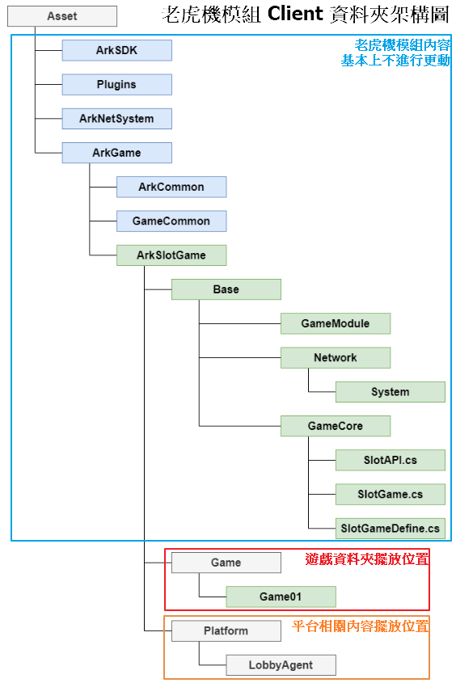
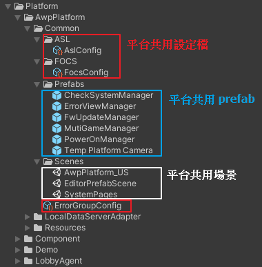
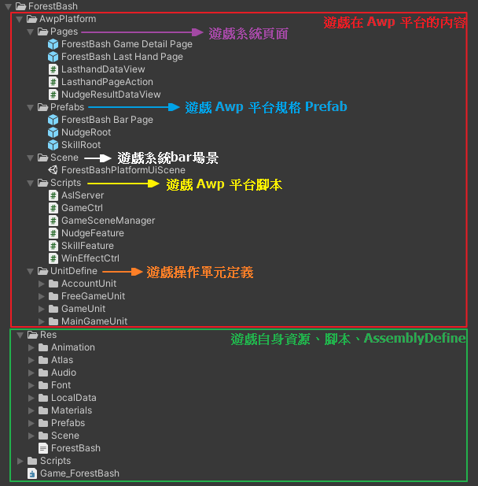
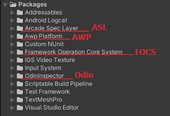

# 資料夾開發規範說明

大綱
* [資料夾結構介紹](#資料夾結構介紹)
	* [平台相關內容資料夾](#平台相關內容資料夾)
	* [遊戲資料夾](#遊戲資料夾)
	* [Packages 資料夾](#packages-資料夾)

## 資料夾結構介紹
大致上分為三個部分，包含老虎機模組主要內容、遊戲擺放區域、平台相關內容擺放區域。
* 老虎機模組主要內容：為了保證跨專案間的模組一致性，避免進行更動。
* 遊戲擺放區域：每款遊戲一個資料夾，擺放在 Game 資料夾底下。
* 平台相關內容擺放區域：AWP 平台相關內容統一放在 Platform/AwpPlatform 資料夾下。

### 平台相關內容資料夾
主要包含共用的設定檔、共用 prefab、共用場景等資源。

### 遊戲資料夾
主要包含遊戲在 AwpPlatform 平台的內容，以及遊戲自身資源等兩大部分。

* 遊戲在 Awp 平台
	* 系統頁面
	包含 GameDetail、[Lasthand 頁面](../../如何使用 ASL 客製化遊戲的帳目資料/readme.md#建立遊戲-lasthand-頁面)、以及相關腳本。
	* 平台規格 Prefab
	包含系統 bar、Nudge 玩法、Skill 玩法的預置物。
	* 系統 bar 場景
	存放製作遊戲系統 bar 的 XXXPlatformUiScene 平台 UI 場景。
	* 平台腳本
	存放遊戲內會用到的平台相關腳本，例如 localServer、Nudge 與 Skill 玩法的 Feature 腳本、報獎腳本等等。
	* 操作單元定義
	存放遊戲會用到的 FOCS 操作單元，包含 GameUnit、MainGameUnit、FreeGameUnit、AccountUnit 等等。

* 遊戲自身資源
	* Animation:  Animation 與 Animator
	* Atlas: 遊戲的圖片資源
	* Audio: 遊戲的音樂音效
	* Font: 遊戲用的字型與字型預置物
	* LocalData: 提供給 server 讀取的測試用假資料
	* Materials: 遊戲內的材質與貼圖
	* Prefabs: 遊戲內的預置物，包含 Spine 與 Symbol 等
	* Scene: 遊戲場景
	* Scripts: 遊戲腳本
	* AssemblyDefine: 遊戲的程式集定義檔

### Packages 資料夾
<mark>與 Assets 資料夾同一層</mark>有一個 Packages 資料夾，此資料夾下會存放透過 Unity Package Manager 管理的套件。
若遊戲專案有使用 Unity Package Manager 匯入套件，該套件就會放在此資料夾下。
* ASL_AWP 相關套件
	* Arcade Spec Layer(ASL): igslib、裝置控制...
	* Awp Platform(AWP): 系統頁、平台相關操作單元...
	* Framework Operation Core System(FOCS): 核心框架
	* OdinInspector(Odin): 編輯器、序列化功能...
