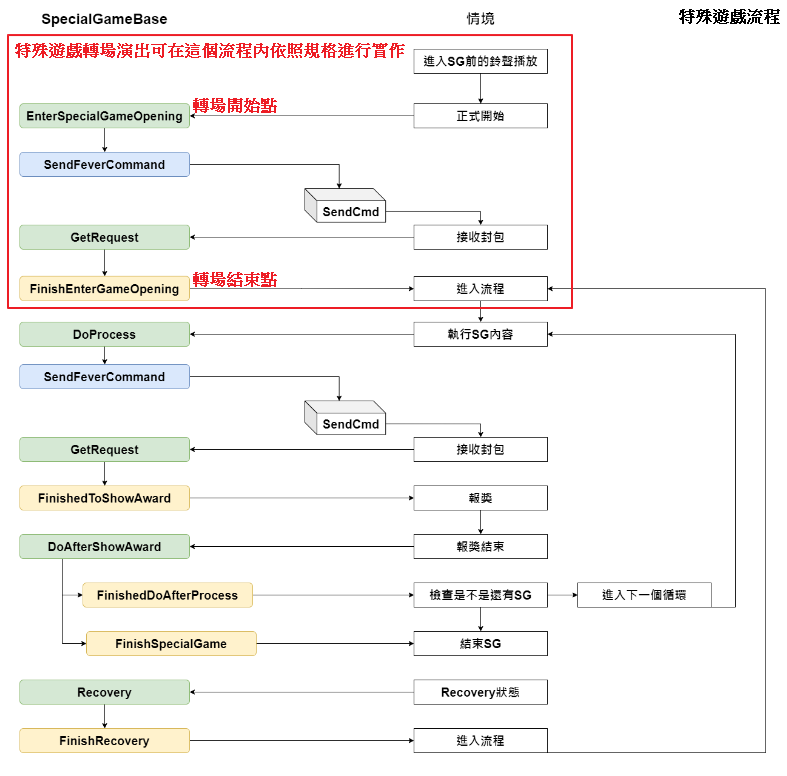

# 轉場開發手冊

大綱
* [轉場時機](#轉場時機)
* [轉場演出](#轉場演出)
* [轉場流程](#轉場流程)
* [斷電回復](#斷電回復)

## 轉場時機
轉場指的是特殊遊戲的進場，屬於特殊遊戲流程裡的 `EnterSpecialGameOpening` 到 `FinishEnterGameOpening`，此階段主要用來設定特殊遊戲資料與控制轉場的演出。


轉場的時間點主要在主遊戲的 `AfterShowAward` 之後，主遊戲若檢查到要進入特殊遊戲，則會一路呼叫到 SpecialGameAgent 的 `DoSpecialGame` 方法，該方法會呼叫對應特殊遊戲的 `EnterSpecialGameOpening`，遊戲要自行實作 `EnterSpecialGameOpening` 的內容。


## 轉場演出
進入特殊遊戲後通常會變更背景，讓玩家更能體會特殊遊戲的氛圍，但是我們又不能非常突兀的直接換掉背景。
因此在轉場表演中，基本上會有某段時間點，整個遊戲畫面會被轉場演出蓋住，我們可以在這段蓋住遊戲畫面的時間點切換背景。


## 轉場流程
以森林狂歡為例，在 `EnterSpecialGameOpening` 階段進行特殊遊戲的資料重置後，呼叫 `SendFeverCommand` 發 command 給 server。
```
EnterSpecialGameOpening(JSON JsonData)
{
    Initialized(); //重置特殊遊戲資料
    SendFeverCommand(null); //發Cmd給server
}
```
server 會送回來一份初始化的封包觸發 `GetRequest`，由於是初始化封包，所以遊戲會執行 `ReceiveInitData` 方法，將 server 給的初始化資料設定好，並呼叫 `ShowOpening` 來進行轉場演出。
```
GetRequest(JSON jsonData)
{
    case SpecialGameState.INIT:
        ReceiveInitData(jsonData);
}
ReceiveInitData(JSON jsonData)
{
    ... //設定初始化資料
    ShowOpening(isUnlock, needShowTipBoard).Forget(); //轉場演出
}
```
轉場演出主要做的事情包含音效控制、演出物件控制、開關主遊戲物件與特殊遊戲物件等等，並且最後呼叫 `FinishEnterGameOpening` 結束轉場流程。
```
async UniTaskVoid ShowOpening(bool isUnlock, bool isShowTip)
{
    //音效控制、演出物件控制、開關主遊戲物件與特殊遊戲物件
    PlayAudio();
    OpenTransitions();
    ShowFreeGame();
    HideMainGame();
    ...

    //結束轉場流程
    FinishEnterGameOpening();
}
```


## 斷電回復
轉場階段的斷電回復，一樣是讓轉場階段從頭開始，因此轉場過程中斷電，開機回來後，在畫面上看起來都會從"播放觸發轉場音效"開始演出。

一方面我們可以不需要很麻煩的去記錄轉場演出到哪個過程，另一方面也能讓玩家在開機回來後，重新看到轉場演出，再一次提醒玩家斷電前遊戲正要進入特殊遊戲。
