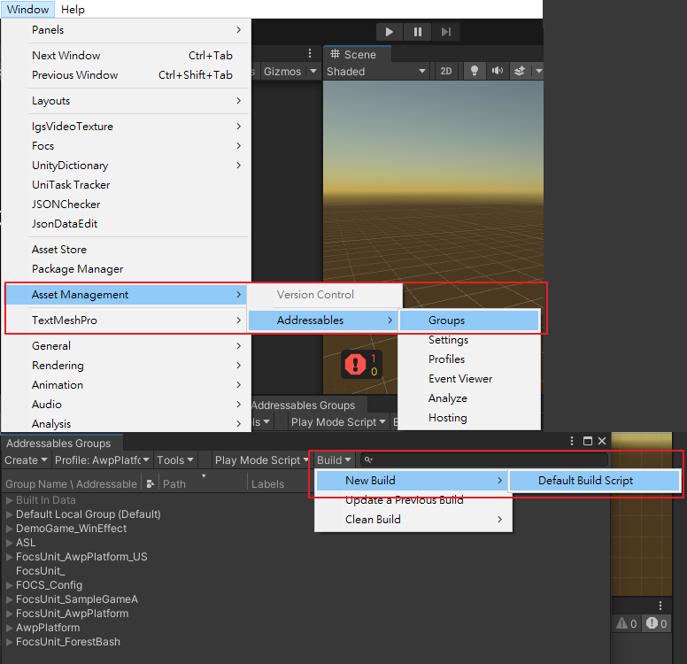
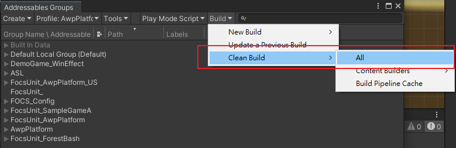
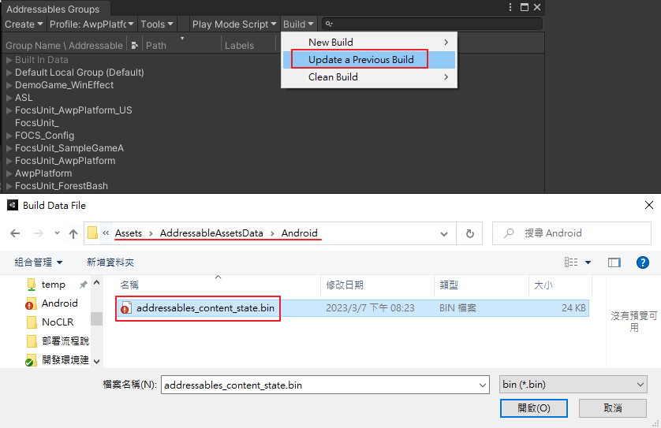
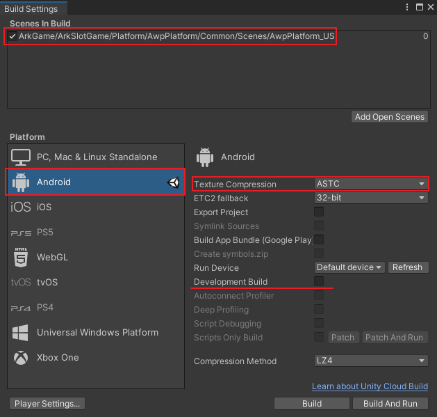
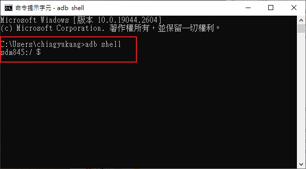
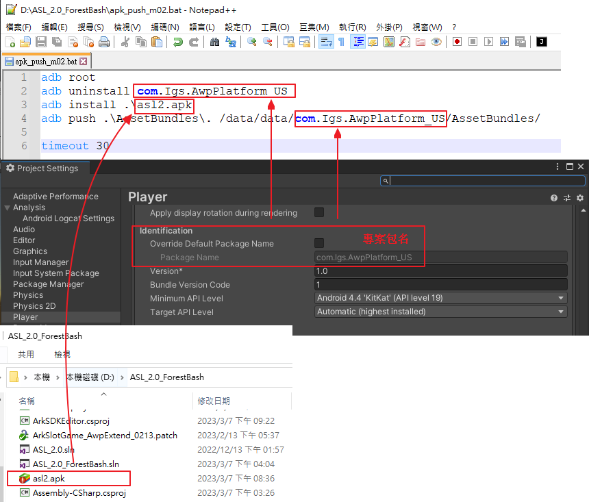
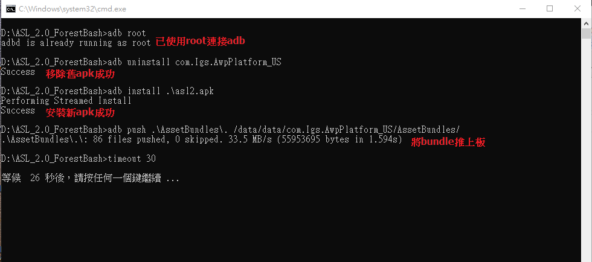

# 部署流程說明

大綱
* [建置 Bundle](#建置-bundle)
* [建置 APK](#建置-apk)
* [上板步驟](#上板步驟)

## 建置 Bundle
* 開啟選單 Window > Asset Management > Addressables > Groups。
* 初次建置 Bundle，在 Addressables Groups 視窗中點選工具列 Build > New Build > Default Build Script。

	* 完成建置後會在專案資料夾底下的 AssetBundles 資料夾內產出 bundle 檔案。同時會在 Assets>AddressableAssetsData>Android 資料夾下生出 addressables_content_state.bin 檔案。
* 非初次建立 Bundle 有兩種做法：
	* 在 Addressables Groups 視窗中點選工具列 Build > Clean Build > All，並手動將 AssetBundles 資料夾內的檔案全數刪除，最後再重新透過 New Build 產出 bundle。(此方法能完整清除舊的 bundle 檔案)
	
	* 也可在 Addressables Groups 視窗中點選工具列 Build > Update a Previous Build，並選擇 Assets>AddressableAssetsData>Android 資料夾下的 addressables_content_state 檔案進行更新 bundle。(此方法會殘餘一些舊的 bundle 檔案)
	

## 建置 APK
* 開啟選單 File > Build Settings。
* 建置前檢查
	* Scene In Build 內有 AwpPlatform_US 場景。
	* Texture Compression 為 ASTC。
	* 平台為 Android。
	* Development Build 視需要開啟(有較詳細的 log stack、可連接 profiler)。
	
* 點選 Build 開始建置 APK

## 上板步驟
* PC 開啟 cmd 命令提示字元，輸入 adb shell 確認連線成功

* 使用文字編輯器(例如 Notepad++)開啟專案資料夾內的 apk_push_m02.bat 批次檔
	* 確認專案包名(com.Igs.XXX)正確。
	* 確認 apk 檔案名稱正確。

* 執行 apk_push_m02.bat 檔案，確認上板成功即可。
