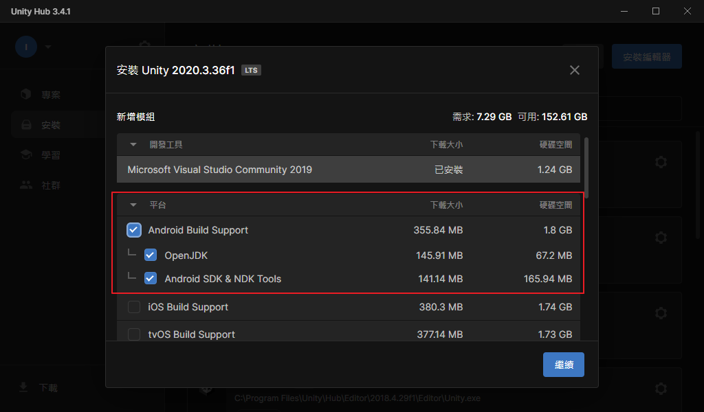
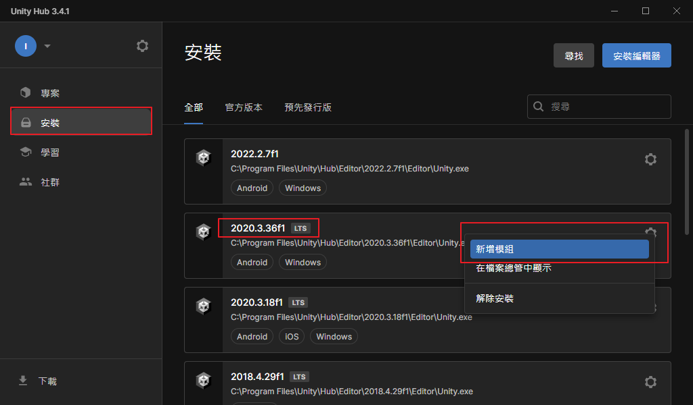
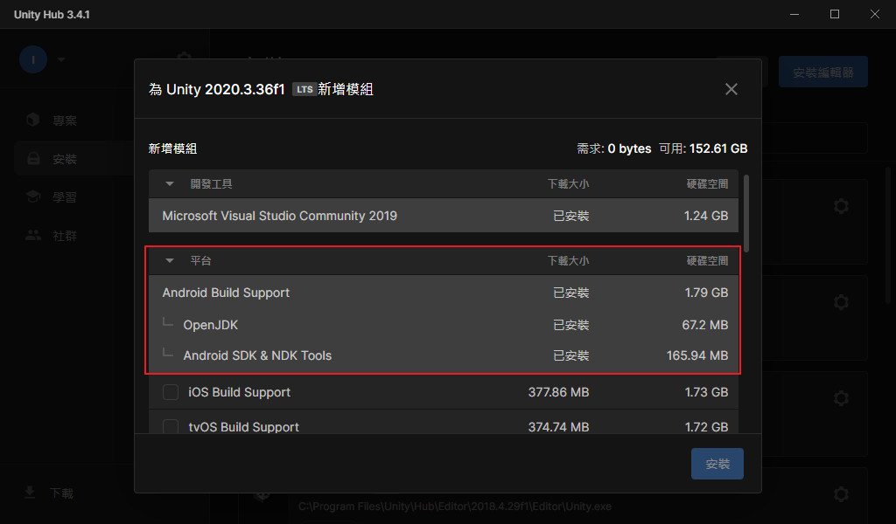
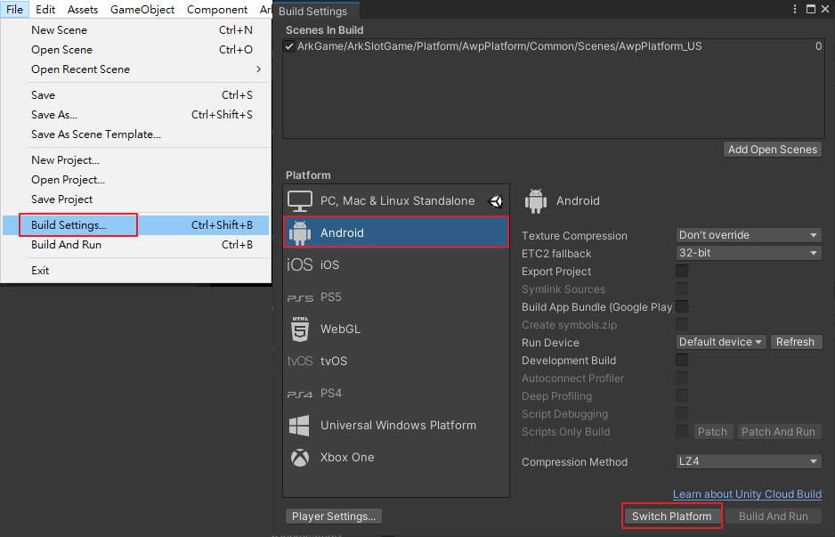
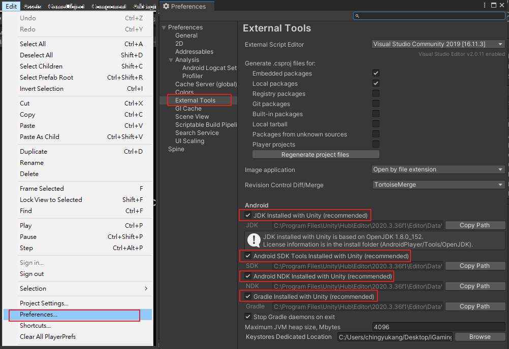

# 開發環境建置

大綱
* [Unity 安裝](#unity-安裝)
* [切換到 Android 平台](#切換到-android-平台)
* [External Tools 設定](#external-tools-設定)
* [遊戲 Define 介紹](#遊戲-define-介紹)

## Unity 安裝
* 下載安裝 Unity Hub: [https://unity.com/download](https://unity.com/download)
* 下載安裝 Unity2020.3.36f1: [https://unity.com/releases/editor/archive](https://unity.com/releases/editor/archive)
	* 點選對應版本下的 "Unity Hub" 按鈕，使用 Hub 進行安裝。
	* Unity Hub 會跳出安裝視窗，在下方平台部分勾選整個 Android Build Support 模組，接著按下安裝。
	
* 若已安裝過 Unity2020.3.36f1 版本，則須確認有安裝 Android 模組：
	* 開啟 Unity Hub，切換到選單中的安裝頁面，找到對應的版本，點選新增模組
	
	* 確認安卓模組有安裝
	
	
## 切換到 Android 平台
* 開啟選單 File > Build Settings
* 選取 Android 平台並按下 Switch Platform

## External Tools 設定
* 開啟選單 Editor > Preferences。
* 選擇 External Tools。
* 確定 JDK、SDK、NDK、Gradle 都有勾選使用 Unity 預設安裝好的路徑，若有找不到檔案的錯誤訊息，則需參考[Unity 安裝](#切換到-android-平台)小節補安裝 Android 模組。

## 遊戲 Define 介紹
* 待補充